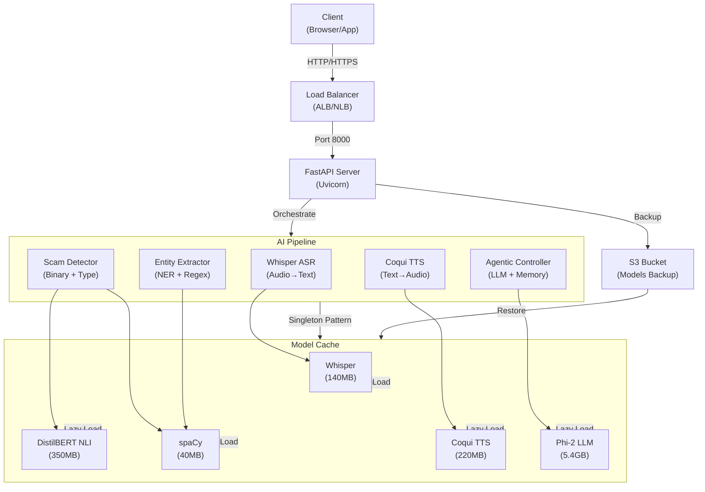
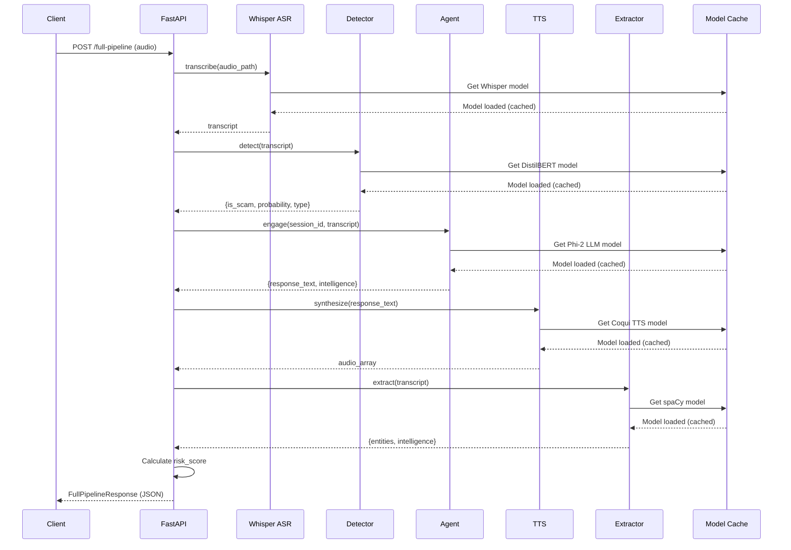

# Agentic AI Scam Honeypot System (Backend)

## Project Overview

The backend provides a production-ready FastAPI application for an Agentic AI Scam Honeypot System. It orchestrates multiple AI/ML models through a modular pipeline architecture suitable for AWS EC2 deployment. The system performs real-time scam detection, conversational engagement, and intelligence extraction from call center audio or transcripts.

**Key Features:**
- Multi-stage scam detection (binary classification + scam type categorization)
- Real-time speech-to-text transcription (Whisper ASR)
- Conversational agent with session memory and safety guardrails
- Text-to-speech synthesis (Coqui TTS) with Indian English voice
- Named entity extraction combining spaCy NER with regex patterns
- Comprehensive API with demo mode for development
- Singleton pattern for efficient resource management
- Thread-safe model loading with CUDA/CPU auto-fallback

---

## Table of Contents

1. [Quick Start (5 Minutes)](#quick-start-5-minutes)
2. [EC2 Setup Instructions](#ec2-setup-instructions)
3. [Model Download Workflow](#model-download-workflow)
4. [Server Startup](#server-startup)
5. [API Documentation](#api-documentation)
6. [Hackathon Problem Statement 1 - AI Voice Detection](#hackathon-problem-statement-1---ai-voice-detection)
7. [Hackathon Problem Statement 2 - Agentic Honeypot](#hackathon-problem-statement-2---agentic-honeypot)
8. [Hackathon Testing Guide](#hackathon-testing-guide)
9. [Demo Mode Usage](#demo-mode-usage)
10. [GPU vs CPU Deployment](#gpu-vs-cpu-deployment)
11. [Troubleshooting](#troubleshooting)
12. [Production Deployment](#production-deployment)
13. [Architecture](#architecture)

---

## Quick Start (5 Minutes)

### Hackathon Quick Start

For hackathon evaluation, follow these steps:

1. **Clone and Setup:**
```bash
cd backend
python -m venv venv
source venv/bin/activate  # Windows: venv\Scripts\activate
pip install -r requirements.txt
```

2. **Configure API Key:**
```bash
cp .env.example .env
# Verify API_SECRET_KEY=sk_test_123456789 in .env
```

3. **Download Models (or use Demo Mode):**
```bash
# Option A: Download real models (~6GB, 15-20 min)
python scripts/download_models.py

# Option B: Use demo mode for quick testing
echo "DEMO_MODE=true" >> .env
```

4. **Start Server:**
```bash
uvicorn app.main:app --host 0.0.0.0 --port 8000
```

5. **Test Endpoints:**
```bash
# Health check
curl http://localhost:8000/health

# PS1: Voice Detection
curl -X POST http://localhost:8000/api/voice-detection \
  -H "x-api-key: sk_test_123456789" \
  -H "Content-Type: application/json" \
  -d '{"language": "English", "audioFormat": "mp3", "audioBase64": "..."}'

# PS2: Honeypot
curl -X POST http://localhost:8000/api/honeypot \
  -H "x-api-key: sk_test_123456789" \
  -H "Content-Type: application/json" \
  -d '{"sessionId": "test", "message": {...}, "conversationHistory": []}'
```

### For Local Development

```bash
# 1. Clone repository
git clone <repo-url>
cd backend

# 2. Create virtual environment
python3 -m venv venv
source venv/bin/activate  # On Windows: venv\Scripts\activate

# 3. Install dependencies
pip install -r requirements.txt

# 4. Configure environment (copy template)
cp .env.example .env
# Edit .env with your settings (optional for demo mode)

# 5. Download models (takes 10-20 minutes)
python scripts/download_models.py

# 6. Start development server
uvicorn app.main:app --reload --host 0.0.0.0 --port 8000

# 7. Test API
curl http://localhost:8000/health
```

### For EC2 Deployment

```bash
# 1. Launch EC2 instance
# AMI: Ubuntu 22.04 LTS
# Instance Type: t3.large (CPU) or g4dn.xlarge (GPU)
# Storage: 30GB EBS volume minimum
# Security Group: Allow SSH (22) and API (8000)

# 2. SSH into instance
ssh -i your-key.pem ubuntu@<ec2-ip>

# 3. Install system dependencies
sudo apt update && sudo apt install -y python3.10 python3-pip git ffmpeg libsndfile1

# 4. Clone and setup
git clone <repo-url> && cd backend
python3 -m venv venv && source venv/bin/activate
pip install -r requirements.txt

# 5. Configure for EC2
cp .env.example .env
nano .env  # Edit for your instance type
# For t3.large: DEVICE=cpu, API_WORKERS=2
# For g4dn.xlarge: DEVICE=cuda, API_WORKERS=4

# 6. Download models
python scripts/download_models.py

# 7. Start production server
uvicorn app.main:app --host 0.0.0.0 --port 8000 --workers 2

# 8. Access from your local machine
curl http://<ec2-ip>:8000/health
```

---

## EC2 Setup Instructions

### Prerequisites

- **AWS Account** with EC2 access
- **SSH Key Pair** created in AWS
- **Security Group** with:
  - SSH (port 22) from your IP
  - Custom TCP (port 8000) from 0.0.0.0/0 or specific IP

### Instance Configuration

#### CPU Deployment (Cost-Effective)

```
Instance Type:  t3.large
vCPU:           2 cores
Memory:         8 GB
Storage:        30 GB EBS (gp3)
AMI:            Ubuntu 22.04 LTS
Cost:           ~$0.10/hour
Suitable For:   Development, demos, low-traffic production
```

#### GPU Deployment (High Performance)

```
Instance Type:  g4dn.xlarge
vCPU:           4 cores
Memory:         16 GB
GPU:            1x NVIDIA T4 (16GB VRAM)
Storage:        30 GB EBS (gp3)
AMI:            Ubuntu 22.04 LTS
Cost:           ~$0.53/hour
Suitable For:   Real-time inference, high-traffic production
```

#### Hackathon Deployment Checklist

Before submitting for evaluation:

- [ ] API key configured (`API_SECRET_KEY` in `.env`)
- [ ] Models downloaded or `DEMO_MODE=true` set
- [ ] Server accessible on public IP/domain
- [ ] Port 8000 open in security group
- [ ] HTTPS configured (recommended for production)
- [ ] GUVI callback URL reachable (`GUVI_CALLBACK_ENABLED=true`)
- [ ] Test both `/api/voice-detection` and `/api/honeypot` endpoints
- [ ] Verify authentication with valid/invalid API keys
- [ ] Monitor logs for callback success

**Public Endpoint Format:**
```
https://your-domain.com/api/voice-detection
https://your-domain.com/api/honeypot
```

### Initial Setup Commands

```bash
# 1. Update system
sudo apt update && sudo apt upgrade -y

# 2. Install Python and dependencies
sudo apt install -y \
    python3.10 \
    python3.10-dev \
    python3.10-venv \
    python3-pip \
    git \
    ffmpeg \
    libsndfile1 \
    curl \
    build-essential

# 3. (GPU Only) Install NVIDIA drivers and CUDA
sudo apt install -y ubuntu-drivers-common
sudo ubuntu-drivers autoinstall
# Verify: nvidia-smi

# 4. Clone repository
cd ~
git clone <repo-url>
cd backend

# 5. Create virtual environment
python3.10 -m venv venv
source venv/bin/activate

# 6. Upgrade pip
pip install --upgrade pip setuptools wheel

# 7. Install dependencies
pip install -r requirements.txt

# 8. Verify GPU support (GPU only)
python -c "import torch; print('GPU Available:', torch.cuda.is_available())"
```

---

## Model Download Workflow

### Pre-Download Checklist

- **Disk Space**: Ensure at least 20 GB free space (for all models)
- **Internet**: Stable connection (downloads are 1-2 GB total)
- **Time**: Allow 10-20 minutes for first-time download

### Download Models

```bash
# Navigate to backend directory
cd backend

# Activate virtual environment
source venv/bin/activate

# Run download script
python scripts/download_models.py
```

### Expected Downloads

| Model | Size | Time | Source |
|-------|------|------|--------|
| Whisper (base) | 140 MB | 2-3 min | OpenAI |
| DistilBERT NLI | 350 MB | 3-4 min | Meta/Facebook |
| spaCy en_core_web_sm | 40 MB | 1 min | spaCy |
| Coqui TTS | 220 MB | 3-4 min | Coqui |
| Phi-2 LLM | 5.4 GB | 8-10 min | Microsoft |
| **Total** | **~6.1 GB** | **~20 min** | - |

### Troubleshooting Downloads

**Issue: "Connection timeout" or "No internet connection"**
```bash
# Check connectivity
ping google.com

# Retry with longer timeout
pip install --default-timeout=1000 -r requirements.txt
```

**Issue: "Insufficient disk space"**
```bash
# Check available space
df -h

# Free up space or mount larger volume
# See troubleshooting section for details
```

**Issue: "Download interrupted"**
```bash
# Clear pip cache and retry
pip cache purge
python scripts/download_models.py
```

### Verify Model Integrity

```bash
# Check models directory
ls -lh models/

# Verify with Python
python -c "
from app.models.model_loader import get_model_loader
loader = get_model_loader()
loader.validate_all_models()
print('All models validated successfully!')
"
```

---

## Server Startup

### Development Mode

```bash
# Auto-reload on code changes, single worker
uvicorn app.main:app --reload --host 0.0.0.0 --port 8000
```

### Production Mode (Recommended for EC2)

```bash
# CPU instance (t3.large with 2 cores)
uvicorn app.main:app --host 0.0.0.0 --port 8000 --workers 2

# GPU instance (g4dn.xlarge with 4 cores)
uvicorn app.main:app --host 0.0.0.0 --port 8000 --workers 4
```

### Docker Deployment

```bash
# CPU image (default)
# Build the CPU-only image (uses Dockerfile):
docker build -t scam-honeypot:cpu -f Dockerfile .

# Run CPU container (mount local models directory, set workers):
docker run \
  -p 8000:8000 \
  -v $(pwd)/models:/app/models \
  -e DEVICE=cpu \
  -e API_WORKERS=2 \
  -e LOG_LEVEL=info \
  scam-honeypot:cpu

# GPU image (optional)
# Build a GPU-enabled image using the provided Dockerfile.gpu. You should
# supply a CUDA-enabled PyTorch wheel URL at build time via the
# `TORCH_WHEEL_URL` build-arg. Example (replace with the correct wheel URL
# for your CUDA version):
#
# docker build -t scam-honeypot:gpu -f Dockerfile.gpu \
#     --build-arg TORCH_WHEEL_URL="https://download.pytorch.org/whl/cu122/torch-<version>-cp311-cp311-linux_x86_64.whl" .
#
# Run GPU container (requires NVIDIA Container Toolkit / Docker Engine with GPU support):
docker run --gpus all \
  -p 8000:8000 \
  -v $(pwd)/models:/app/models \
  -e DEVICE=cuda \
  -e API_WORKERS=4 \
  -e LOG_LEVEL=info \
  scam-honeypot:gpu
```

### Systemd Service (Optional Auto-Start)

Create `/etc/systemd/system/scam-honeypot.service`:

```ini
[Unit]
Description=Agentic AI Scam Honeypot Backend
After=network.target

[Service]
Type=simple
User=ubuntu
WorkingDirectory=/home/ubuntu/backend
Environment="PATH=/home/ubuntu/backend/venv/bin"
ExecStart=/home/ubuntu/backend/venv/bin/uvicorn app.main:app --host 0.0.0.0 --port 8000 --workers 2
Restart=on-failure
RestartSec=5

[Install]
WantedBy=multi-user.target
```

Then:

```bash
sudo systemctl daemon-reload
sudo systemctl enable scam-honeypot
sudo systemctl start scam-honeypot
sudo systemctl status scam-honeypot
```

---

## API Documentation

### Base URL

```
http://<host>:8000
```

### Health Check

**Endpoint:** `GET /health`

Check if API is running and healthy.

**Response (200 OK):**
```json
{
  "status": "success",
  "message": "Service is healthy",
  "timestamp": "2024-01-30T10:30:45.123456Z"
}
```

**Example:**
```bash
curl http://localhost:8000/health
```

---

### POST /api/v1/detect

Detect scam indicators in a transcript.

**Request Body (JSON):**
```json
{
  "transcript": "Hello sir, I'm calling from your bank. We've detected suspicious activity on your account..."
}
```

**Response (200 OK):**
```json
{
  "status": "success",
  "timestamp": "2024-01-30T10:30:45.123456Z",
  "transcript": "Hello sir, I'm calling from your bank...",
  "is_scam": true,
  "scam_probability": 0.92,
  "scam_type": "phishing",
  "confidence_scores": {
    "phishing": 0.92,
    "tech_support": 0.05,
    "lottery": 0.01,
    "investment": 0.01,
    "romance": 0.00,
    "impersonation": 0.01,
    "refund": 0.00,
    "job": 0.00,
    "other": 0.00
  }
}
```

**Example:**
```bash
curl -X POST http://localhost:8000/api/v1/detect \
  -H "Content-Type: application/json" \
  -d '{"transcript": "Hello sir, I am calling from your bank"}'
```

**Status Codes:**
- `200 OK` - Successful detection
- `400 Bad Request` - Empty or invalid transcript
- `500 Internal Server Error` - Processing error

---

### POST /api/v1/engage

Conversational engagement with intelligent response generation and audio synthesis.

**Request Form Data:**
- `session_id` (string, required): Unique session identifier
- `audio` (file, optional): Audio file (WAV, MP3, M4A, FLAC, OGG)
- `text` (string, optional): Text transcript (if audio not provided)
- `conversation_history` (string, optional): JSON array of previous messages

**Request Examples:**

With text:
```bash
curl -X POST http://localhost:8000/api/v1/engage \
  -F "session_id=session_12345" \
  -F "text=Hello, what is your bank account number?"
```

With audio file:
```bash
curl -X POST http://localhost:8000/api/v1/engage \
  -F "session_id=session_12345" \
  -F "audio=@audio.wav"
```

With conversation history:
```bash
curl -X POST http://localhost:8000/api/v1/engage \
  -F "session_id=session_12345" \
  -F "text=And my card details?" \
  -F 'conversation_history=[{"role": "user", "content": "Hello"}, {"role": "assistant", "content": "Hi there"}]'
```

**Response (200 OK):**
```json
{
  "status": "success",
  "timestamp": "2024-01-30T10:30:45.123456Z",
  "session_id": "session_12345",
  "transcript": "Hello, what is your bank account number?",
  "agent_response_text": "I appreciate your trust, but I cannot provide that information. Let me help you with your banking needs.",
  "agent_response_audio": "UklGRiYAAABXQVZFZm10IBAAAAABAAEAQB8AAAB9AAACABAAZGF0YQIAAAAAAA==",
  "turn_number": 1,
  "terminated": false,
  "extracted_intelligence": [
    {
      "type": "request_type",
      "value": "bank_account_request",
      "confidence": 0.95
    }
  ]
}
```

**Status Codes:**
- `200 OK` - Successful engagement
- `400 Bad Request` - Missing/invalid input
- `500 Internal Server Error` - Processing error

---

### POST /api/v1/extract

Extract entities and scammer intelligence from transcript.

**Request Body (JSON):**
```json
{
  "transcript": "My name is John, call me at 9876543210 or john@email.com"
}
```

**Response (200 OK):**
```json
{
  "status": "success",
  "timestamp": "2024-01-30T10:30:45.123456Z",
  "transcript": "My name is John, call me at 9876543210...",
  "entities": {
    "PERSON": [{"text": "John", "start": 11, "end": 15, "confidence": 0.98}],
    "EMAIL": [{"text": "john@email.com", "start": 31, "end": 45, "confidence": 0.99}]
  },
  "scammer_intelligence": {
    "contact_info": {
      "phone_numbers": ["+919876543210"],
      "emails": ["john@email.com"],
      "upi_ids": []
    },
    "payment_methods": {
      "upi_ids": [],
      "account_numbers": [],
      "ifsc_codes": []
    },
    "organizations": [],
    "locations": [],
    "persons": ["John"],
    "urls": [],
    "financial_references": [],
    "total_entities_found": 3,
    "high_risk_indicators": []
  },
  "confidence_scores": {
    "overall": 0.82,
    "contact_info": 0.95,
    "payment_methods": 0.50
  }
}
```

**Example:**
```bash
curl -X POST http://localhost:8000/api/v1/extract \
  -H "Content-Type: application/json" \
  -d '{"transcript": "My name is John, call me at 9876543210"}'
```

**Status Codes:**
- `200 OK` - Successful extraction
- `400 Bad Request` - Empty or invalid transcript
- `500 Internal Server Error` - Processing error

---

### POST /api/v1/full-pipeline

Execute complete pipeline: ASR → Detection → Engagement → TTS → Extraction.

**Request Form Data:**
- `audio` (file, required): Audio file to process
- `session_id` (string, optional): Session identifier (auto-generated if omitted)
- `demo_mode` (boolean, optional): Override DEMO_MODE setting for this request

**Request Example:**
```bash
curl -X POST http://localhost:8000/api/v1/full-pipeline \
  -F "audio=@call_recording.wav" \
  -F "session_id=call_12345" \
  -F "demo_mode=false"
```

**Response (200 OK):**
```json
{
  "status": "success",
  "timestamp": "2024-01-30T10:30:45.123456Z",
  "transcript": "Hello, is this John?",
  "scam_detection": {
    "status": "success",
    "is_scam": true,
    "scam_probability": 0.87,
    "scam_type": "phishing",
    "confidence_scores": {...}
  },
  "agent_response": {
    "status": "success",
    "session_id": "call_12345",
    "transcript": "Hello, is this John?",
    "agent_response_text": "Yes, how can I help?",
    "agent_response_audio": "UklGRi...",
    "turn_number": 1,
    "terminated": false,
    "extracted_intelligence": [...]
  },
  "extracted_entities": {
    "status": "success",
    "entities": {...},
    "scammer_intelligence": {...},
    "confidence_scores": {...}
  },
  "risk_score": 0.78,
  "processing_time_ms": 3245
}
```

**Status Codes:**
- `200 OK` - Successful pipeline execution
- `400 Bad Request` - Invalid audio file
- `500 Internal Server Error` - Pipeline stage failed

---

## Hackathon Problem Statement 1 - AI Voice Detection

**Endpoint:** `POST /api/voice-detection`

**Purpose:** Detect whether a voice sample is AI-generated or human across 5 languages (Tamil, English, Hindi, Malayalam, Telugu)

**Authentication:** Required via `x-api-key` header

**Request Format:**
```json
{
  "language": "Tamil",
  "audioFormat": "mp3",
  "audioBase64": "SUQzBAAAAAAAI1RTU0UAAAAPAAADTGF2ZjU2LjM2LjEwMAAAAAAA..."
}
```

**Response Format (Success):**
```json
{
  "status": "success",
  "language": "Tamil",
  "classification": "AI_GENERATED",
  "confidenceScore": 0.91,
  "explanation": "Unnatural pitch consistency and robotic speech patterns detected"
}
```

**Response Format (Error):**
```json
{
  "status": "error",
  "message": "Invalid API key or malformed request"
}
```

**cURL Example:**
```bash
curl -X POST http://localhost:8000/api/voice-detection \
  -H "Content-Type: application/json" \
  -H "x-api-key: sk_test_123456789" \
  -d '{
    "language": "Tamil",
    "audioFormat": "mp3",
    "audioBase64": "SUQzBAAAAAAAI1RTU0UAAAAPAAADTGF2ZjU2LjM2LjEwMAAAAAAA..."
  }'
```

**Supported Languages:** Tamil, English, Hindi, Malayalam, Telugu

**Classification Values:** `AI_GENERATED` or `HUMAN`

**Status Codes:**
- `200 OK` - Successful classification
- `400 Bad Request` - Invalid language, format, or missing fields
- `401 Unauthorized` - Invalid or missing API key
- `500 Internal Server Error` - Processing error

**Model Used:** `MelodyMachine/Deepfake-audio-detection-V2` (Wav2Vec2-based, 99% accuracy)

---

## Hackathon Problem Statement 2 - Agentic Honeypot

**Endpoint:** `POST /api/honeypot`

**Purpose:** Detect scam intent and engage scammers autonomously in multi-turn conversations to extract intelligence

**Authentication:** Required via `x-api-key` header

**Request Format (First Message):**
```json
{
  "sessionId": "wertyu-dfghj-ertyui",
  "message": {
    "sender": "scammer",
    "text": "Your bank account will be blocked today. Verify immediately.",
    "timestamp": 1770005528731
  },
  "conversationHistory": [],
  "metadata": {
    "channel": "SMS",
    "language": "English",
    "locale": "IN"
  }
}
```

**Request Format (Follow-up Message):**
```json
{
  "sessionId": "wertyu-dfghj-ertyui",
  "message": {
    "sender": "scammer",
    "text": "Share your UPI ID to avoid account suspension.",
    "timestamp": 1770005528731
  },
  "conversationHistory": [
    {
      "sender": "scammer",
      "text": "Your bank account will be blocked today. Verify immediately.",
      "timestamp": 1770005528731
    },
    {
      "sender": "user",
      "text": "Why will my account be blocked?",
      "timestamp": 1770005528731
    }
  ],
  "metadata": {
    "channel": "SMS",
    "language": "English",
    "locale": "IN"
  }
}
```

**Response Format:**
```json
{
  "status": "success",
  "reply": "Why is my account being suspended?"
}
```

**cURL Example (First Message):**
```bash
curl -X POST http://localhost:8000/api/honeypot \
  -H "Content-Type: application/json" \
  -H "x-api-key: sk_test_123456789" \
  -d '{
    "sessionId": "test-session-001",
    "message": {
      "sender": "scammer",
      "text": "Your bank account will be blocked. Send OTP now.",
      "timestamp": 1770005528731
    },
    "conversationHistory": [],
    "metadata": {
      "channel": "SMS",
      "language": "English",
      "locale": "IN"
    }
  }'
```

**Status Codes:**
- `200 OK` - Successful engagement
- `400 Bad Request` - Invalid request format
- `401 Unauthorized` - Invalid or missing API key
- `500 Internal Server Error` - Processing error

**Automatic Callback:** When scam is detected and engagement completes (3-15 turns), the system automatically sends extracted intelligence to `https://hackathon.guvi.in/api/updateHoneyPotFinalResult`

**Callback Payload:**
```json
{
  "sessionId": "test-session-001",
  "scamDetected": true,
  "totalMessagesExchanged": 8,
  "extractedIntelligence": {
    "bankAccounts": ["XXXX-XXXX-XXXX"],
    "upiIds": ["scammer@upi"],
    "phishingLinks": ["http://malicious-link.example"],
    "phoneNumbers": ["+91XXXXXXXXXX"],
    "suspiciousKeywords": ["urgent", "verify now", "account blocked"]
  },
  "agentNotes": "Scammer used urgency tactics and payment redirection"
}
```

---

## Hackathon Testing Guide

**Prerequisites:**
- Backend server running (`uvicorn app.main:app --host 0.0.0.0 --port 8000`)
- API key configured in `.env` file (`API_SECRET_KEY=sk_test_123456789`)
- Models downloaded (or `DEMO_MODE=true` for quick testing)

**Testing Problem Statement 1 (AI Voice Detection):**

1. **Prepare Base64 MP3 Audio:**
```bash
# Convert MP3 to Base64
base64 -w 0 sample_voice.mp3 > audio_base64.txt
```

2. **Test with Tamil Audio:**
```bash
curl -X POST http://localhost:8000/api/voice-detection \
  -H "Content-Type: application/json" \
  -H "x-api-key: sk_test_123456789" \
  -d '{
    "language": "Tamil",
    "audioFormat": "mp3",
    "audioBase64": "'$(cat audio_base64.txt)'"
  }'
```

3. **Test All Languages:**
```bash
for lang in Tamil English Hindi Malayalam Telugu; do
  echo "Testing $lang..."
  curl -X POST http://localhost:8000/api/voice-detection \
    -H "Content-Type: application/json" \
    -H "x-api-key: sk_test_123456789" \
    -d "{\"language\": \"$lang\", \"audioFormat\": \"mp3\", \"audioBase64\": \"$(cat audio_base64.txt)\"}"
  echo ""
done
```

4. **Expected Response:**
```json
{
  "status": "success",
  "language": "Tamil",
  "classification": "AI_GENERATED",
  "confidenceScore": 0.91,
  "explanation": "Unnatural pitch consistency detected"
}
```

**Testing Problem Statement 2 (Agentic Honeypot):**

1. **Test Initial Scam Detection:**
```bash
curl -X POST http://localhost:8000/api/honeypot \
  -H "Content-Type: application/json" \
  -H "x-api-key: sk_test_123456789" \
  -d '{
    "sessionId": "test-001",
    "message": {
      "sender": "scammer",
      "text": "Your account is suspended. Send OTP immediately.",
      "timestamp": 1770005528731
    },
    "conversationHistory": [],
    "metadata": {"channel": "SMS", "language": "English", "locale": "IN"}
  }'
```

2. **Test Multi-Turn Conversation:**
```bash
# Turn 1
curl -X POST http://localhost:8000/api/honeypot \
  -H "Content-Type: application/json" \
  -H "x-api-key: sk_test_123456789" \
  -d '{
    "sessionId": "test-002",
    "message": {"sender": "scammer", "text": "Your bank account will be blocked.", "timestamp": 1770005528731},
    "conversationHistory": [],
    "metadata": {"channel": "SMS", "language": "English", "locale": "IN"}
  }'

# Turn 2 (with history)
curl -X POST http://localhost:8000/api/honeypot \
  -H "Content-Type: application/json" \
  -H "x-api-key: sk_test_123456789" \
  -d '{
    "sessionId": "test-002",
    "message": {"sender": "scammer", "text": "Send your UPI ID now.", "timestamp": 1770005528732},
    "conversationHistory": [
      {"sender": "scammer", "text": "Your bank account will be blocked.", "timestamp": 1770005528731},
      {"sender": "user", "text": "Why is it blocked?", "timestamp": 1770005528731}
    ],
    "metadata": {"channel": "SMS", "language": "English", "locale": "IN"}
  }'
```

3. **Monitor Callback Logs:**
```bash
# Check server logs for callback to GUVI endpoint
tail -f logs/app.log | grep "updateHoneyPotFinalResult"
```

4. **Expected Behavior:**
- First message: Agent responds cooperatively without revealing detection
- Subsequent messages: Agent maintains persona, extracts intelligence
- After 3-15 turns: Automatic callback sent to GUVI endpoint
- Response always contains `{"status": "success", "reply": "..."}`

**Testing Authentication:**

1. **Test Invalid API Key:**
```bash
curl -X POST http://localhost:8000/api/voice-detection \
  -H "Content-Type: application/json" \
  -H "x-api-key: invalid_key" \
  -d '{"language": "English", "audioFormat": "mp3", "audioBase64": "test"}'
```
Expected: `401 Unauthorized`

2. **Test Missing API Key:**
```bash
curl -X POST http://localhost:8000/api/honeypot \
  -H "Content-Type: application/json" \
  -d '{"sessionId": "test", "message": {...}}'
```
Expected: `401 Unauthorized`

**Demo Mode Testing:**

For quick validation without models:
```bash
# Set in .env
DEMO_MODE=true

# Restart server
uvicorn app.main:app --host 0.0.0.0 --port 8000

# Test endpoints (will return mock responses)
```

---

## Demo Mode Usage

Demo mode allows testing the API without downloading and loading models. Useful for development, CI/CD testing, and frontend integration.

### Enable Demo Mode

**Option 1: Environment Variable**
```bash
# In .env file
DEMO_MODE=true

# Start server
uvicorn app.main:app --host 0.0.0.0 --port 8000
```

**Option 2: Per-Request Override**
```bash
# For /full-pipeline endpoint only
curl -X POST http://localhost:8000/api/v1/full-pipeline \
  -F "audio=@test.wav" \
  -F "demo_mode=true"
```

### Demo Mode Behavior

| Component | Demo Response | Details |
|-----------|---------------|---------|
| ASR | Mock transcript | Returns "Demo transcript" without Whisper |
| Detector | Mock classification | Returns `is_scam=true` with 0.85 probability |
| Agent | Mock response | Returns generic safe response without LLM |
| TTS | Mock audio | Returns synthetic audio samples |
| Extractor | Mock entities | Returns sample entities without spaCy |

### Demo Mode Workflow

```bash
# 1. Start server in demo mode
DEMO_MODE=true uvicorn app.main:app --host 0.0.0.0 --port 8000

# 2. Test endpoints without models
curl http://localhost:8000/health

curl -X POST http://localhost:8000/api/v1/detect \
  -H "Content-Type: application/json" \
  -d '{"transcript": "test"}'

curl -X POST http://localhost:8000/api/v1/full-pipeline \
  -F "audio=@any_file.wav"

# 3. Verify response structure
# All endpoints return valid responses with mock data

# 4. Switch to production mode
DEMO_MODE=false uvicorn app.main:app --host 0.0.0.0 --port 8000

# 5. Download models (if not already done)
python scripts/download_models.py

# 6. Test with real models
# Same curl commands now use actual AI inference
```

---

## GPU vs CPU Deployment

### CPU Deployment (t3.large)

**Characteristics:**
- Cost: ~$0.10/hour
- Memory: 8 GB
- Cores: 2 vCPU
- Best for: Development, demos, low-traffic scenarios

**Performance:**
| Operation | Time |
|-----------|------|
| ASR (30s audio) | 2-5 seconds |
| Scam Detection | 0.3-0.5 seconds |
| LLM Response | 5-10 seconds |
| TTS (50 chars) | 2-4 seconds |
| **Full Pipeline** | **10-20 seconds** |

**Configuration:**
```bash
# .env file for CPU
DEVICE=cpu
API_WORKERS=2
WHISPER_MODEL_NAME=base
LLM_USE_API=false
```

**When to use:**
- Development and testing
- Hackathon/prototype environments
- Batch processing (non-realtime)
- Budget-conscious production

---

### GPU Deployment (g4dn.xlarge)

**Characteristics:**
- Cost: ~$0.53/hour
- Memory: 16 GB RAM + 16 GB GPU VRAM
- GPU: NVIDIA T4 (5,120 CUDA cores)
- Best for: Real-time inference, high-traffic production

**Performance:**
| Operation | Time | Speedup |
|-----------|------|---------|
| ASR (30s audio) | 0.5-1 second | 4-10x |
| Scam Detection | 0.1-0.2 seconds | 3-5x |
| LLM Response | 1-2 seconds | 5-10x |
| TTS (50 chars) | 0.5-1 second | 3-4x |
| **Full Pipeline** | **2-4 seconds** | **5-8x** |

**Setup:**
```bash
# Install NVIDIA drivers
sudo apt install -y nvidia-driver-525

# Verify GPU
nvidia-smi

# Verify PyTorch GPU support
python -c "import torch; print(torch.cuda.is_available())"
```

**Configuration:**
```bash
# .env file for GPU
DEVICE=cuda
API_WORKERS=4
WHISPER_MODEL_NAME=base
LLM_USE_API=false
```

**When to use:**
- Real-time conversational systems
- High-traffic production (>100 requests/hour)
- Low-latency requirements (<5 seconds)
- Interactive/live demo scenarios

---

### Comparison Table

| Metric | CPU (t3.large) | GPU (g4dn.xlarge) |
|--------|---|---|
| Cost/Hour | $0.10 | $0.53 |
| Inference Speed | ~15s/pipeline | ~3s/pipeline |
| Throughput | ~4 calls/min | ~20 calls/min |
| Burst Capacity | Low | High |
| Idle Cost | Low | Higher |
| Suitable Scale | <100 calls/day | >500 calls/day |

---

## Troubleshooting

### Model Download Issues

**Problem: "ConnectionError" during download**
```
FileNotFoundError: Can't find model 'facebook/bart-large-mnli' 
or it is not a valid identifier on model hub
```

**Solution:**
- Check internet connectivity: `ping huggingface.co`
- Retry with longer timeout: `pip install --default-timeout=1000 transformers`
- Use HuggingFace mirror: `export HF_ENDPOINT=https://huggingface.co`
- Check disk space: `df -h`

**Problem: "Out of memory" during download**

**Solution:**
- Free disk space: `rm -rf ~/.cache/huggingface/`
- Use smaller models: Set `WHISPER_MODEL_NAME=tiny` in .env
- Increase EBS volume: Stop instance → Modify volume size → Restart

---

### Runtime Errors

**Problem: "CUDA out of memory" error**
```
RuntimeError: CUDA out of memory. Tried to allocate X.XX GiB
```

**Solution:**
- Reduce batch size (set `API_WORKERS=1`)
- Use CPU instead: `DEVICE=cpu`
- Enable external LLM: `LLM_USE_API=true`
- Upgrade to larger GPU instance

**Problem: "torch.cuda.is_available() returns False" on GPU instance**

**Solution:**
```bash
# Install NVIDIA drivers
sudo apt install -y nvidia-driver-525

# Reboot
sudo reboot

# Verify installation
nvidia-smi

# Reinstall PyTorch with CUDA
pip install torch torchvision torchaudio --index-url https://download.pytorch.org/whl/cu118
```

**Problem: "spaCy model 'en_core_web_sm' not found"**
```
OSError: Can't find model 'en_core_web_sm'
```

**Solution:**
```bash
# Download spaCy model
python -m spacy download en_core_web_sm

# Or run download script
python scripts/download_models.py
```

---

### API Issues

**Problem: "Port 8000 already in use"**
```
Address already in use
```

**Solution:**
```bash
# Find process using port
lsof -ti:8000 | xargs kill -9

# Or use different port
uvicorn app.main:app --host 0.0.0.0 --port 8001
```

**Problem: "Audio file upload fails with 400 error"**

**Solution:**
- Verify audio format (WAV, MP3, M4A, FLAC, OGG supported)
- Check file size (recommended <100 MB)
- Use correct multipart/form-data encoding:
```bash
curl -X POST http://localhost:8000/api/v1/engage \
  -F "session_id=test" \
  -F "audio=@valid_audio.wav"
```

**Problem: Requests timeout (>30 seconds)**

**Solutions:**
- Switch to GPU instance
- Use demo mode for testing
- Reduce `API_WORKERS` to 1
- Disable unnecessary logging: `LOG_LEVEL=WARNING`
- Check server logs: `tail -f /var/log/syslog`

---

### Debugging

**Enable debug logging:**
```bash
# In .env or environment
LOG_LEVEL=DEBUG

# Start server
uvicorn app.main:app --host 0.0.0.0 --port 8000 --log-level debug
```

**View server logs:**
```bash
# Development (console output)
tail -f console.log

# Systemd service
sudo journalctl -u scam-honeypot -f

# Docker container
docker logs -f <container-id>
```

**Monitor resource usage:**
```bash
# Real-time CPU/Memory/GPU
htop

# GPU details
nvidia-smi -l 1  # Updates every 1 second

# Disk usage
df -h
du -sh models/
```

**Test individual components:**
```bash
# Test ASR
python -c "from app.pipeline.asr import get_whisper_asr; asr = get_whisper_asr(); print(asr.transcribe('audio.wav'))"

# Test Detection
python -c "from app.pipeline.detector import get_scam_detector; detector = get_scam_detector(); print(detector.detect('Hello'))"

# Test GPU
python -c "import torch; print('GPU:', torch.cuda.is_available()); print(torch.cuda.get_device_name(0))"
```

---

## Production Deployment

### Security Best Practices

1. **Use HTTPS with reverse proxy (nginx)**
```nginx
server {
    listen 443 ssl http2;
    server_name api.example.com;
    ssl_certificate /etc/ssl/certs/cert.pem;
    ssl_certificate_key /etc/ssl/private/key.pem;
    
    location / {
        proxy_pass http://localhost:8000;
        proxy_set_header Host $host;
        proxy_set_header X-Real-IP $remote_addr;
    }
}
```

2. **Restrict CORS origins**
```bash
# .env file
CORS_ORIGINS=https://app.example.com,https://admin.example.com
```

3. **Use environment variables for secrets**
```bash
# Never commit .env file
echo ".env" >> .gitignore

# Load secrets from AWS Secrets Manager or similar
export LLM_API_KEY=$(aws secretsmanager get-secret-value --secret-id scam-honeypot/llm-api-key)
```

4. **Run as non-root user**
```bash
useradd -m -s /bin/bash appuser
chown -R appuser:appuser /home/appuser/backend
su - appuser
```

### Performance Optimization

1. **Multiple workers**
```bash
# For 4-core GPU instance
uvicorn app.main:app --host 0.0.0.0 --port 8000 --workers 4
```

2. **Load balancing**
```bash
# Use AWS ELB/ALB for horizontal scaling
# Deploy multiple instances behind load balancer
# Auto-scale based on CPU/memory metrics
```

3. **Model caching**
Models are already cached in memory via singleton pattern.

4. **Logging and monitoring**
```bash
# Production logging (INFO level only)
LOG_LEVEL=INFO

# Integrate with CloudWatch
pip install watchtower
```

### Backup and Recovery

1. **Backup models**
```bash
tar -czf models-backup.tar.gz models/
aws s3 cp models-backup.tar.gz s3://your-bucket/
```

2. **EBS snapshots**
```bash
# AWS Console → Volumes → Create Snapshot
# Or via CLI
aws ec2 create-snapshot --volume-id vol-xxx --description "Models backup"
```

3. **Recovery procedure**
```bash
# Restore from snapshot
aws ec2 create-volume --snapshot-id snap-xxx --availability-zone us-east-1a

# Mount volume and restore models
sudo mount /dev/nvme1n1 /mnt
sudo cp -r /mnt/models ~/backend/models
```

---

## Architecture

### Component Diagram



### Request Flow



---

## Project Structure

```
backend/
├── app/
│   ├── main.py              # FastAPI app, routes, startup/shutdown
│   ├── api/
│   │   └── routes.py        # API endpoints (/detect, /engage, /extract, /full-pipeline)
│   ├── core/
│   │   ├── config.py        # Environment configuration
│   │   └── logger.py        # Structured logging
│   ├── pipeline/
│   │   ├── detector.py      # Scam detection (binary + type classification)
│   │   ├── asr.py           # Whisper ASR (audio transcription)
│   │   ├── agent.py         # Agentic controller (LLM + session memory)
│   │   ├── tts.py           # Coqui TTS (speech synthesis)
│   │   └── extractor.py     # Entity extraction (NER + regex patterns)
│   ├── models/
│   │   └── model_loader.py  # Singleton model manager (lazy loading)
│   └── schemas/
│       ├── request.py       # Pydantic request models
│       └── response.py      # Pydantic response models
├── scripts/
│   └── download_models.py   # Model download with disk validation
├── .env.example             # Environment variable template
├── Dockerfile               # Container definition
├── requirements.txt         # Python dependencies
└── README.md               # This file
```

---

## Dependencies

All Python dependencies are specified in `requirements.txt`:

- **FastAPI 0.109.0** - Web framework
- **Uvicorn 0.27.0** - ASGI server
- **PyTorch 2.1.2** - ML framework
- **Transformers 4.37.0** - LLM & models
- **OpenAI Whisper 20231117** - Speech recognition
- **librosa 0.10.1** - Audio processing
- **soundfile 0.12.1** - WAV I/O
- **spaCy 3.7.2** - NER
- **Coqui TTS 0.22.0** - Text-to-speech
- **Pydantic 2.5.3** - Data validation
- **python-dotenv 1.0.0** - Environment loading

See `requirements.txt` for full versions.

---

## License

[Your License Here]

---

## Support

For issues, questions, or contributions:
- GitHub Issues: [repo-url]/issues
- Email: [contact-email]
- Documentation: [docs-url]
